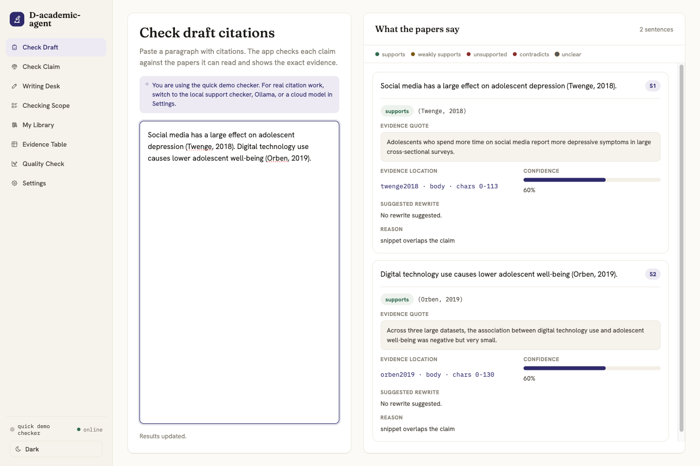
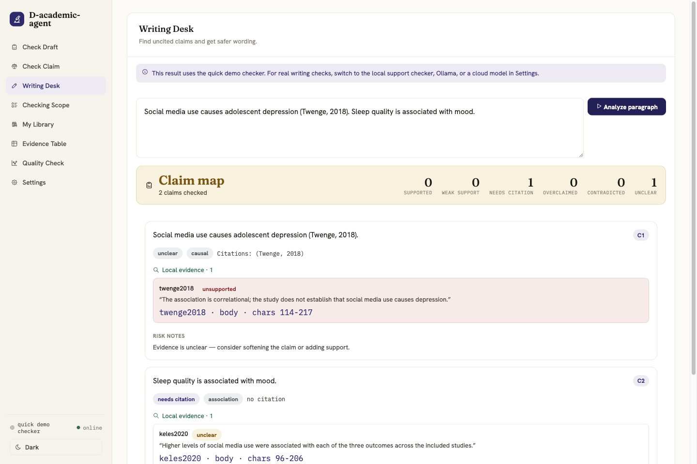
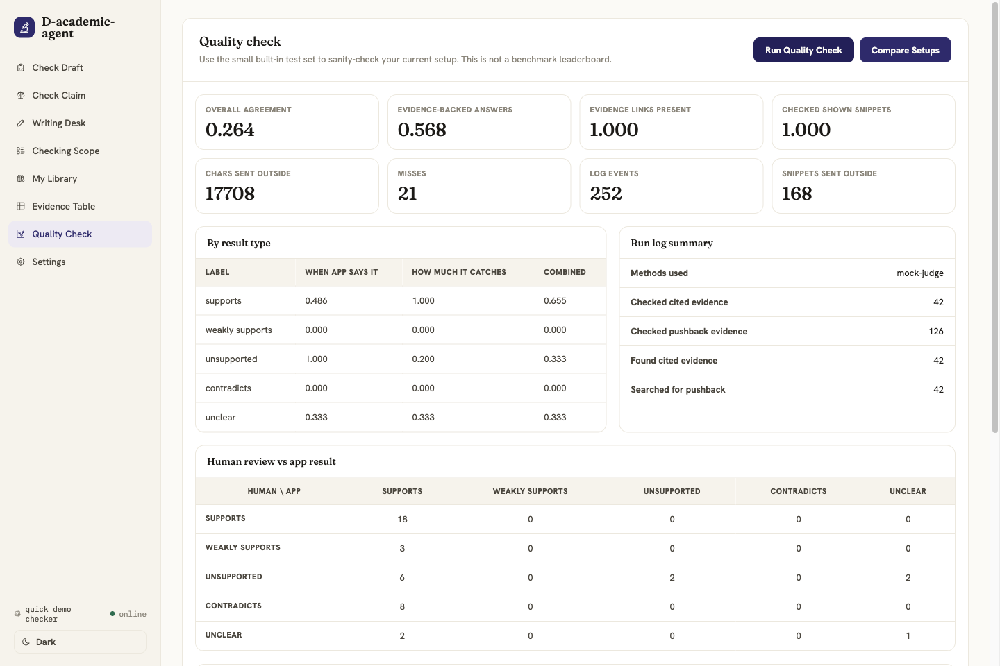

# D-academic-agent

D-academic-agent is a local-first evidence-checking harness for academic literature workflows. It helps a
researcher inspect whether a claim is actually supported by the retrieved paper snippet, then keeps the result
traceable to a source, quote, locator, verdict, and run trace.

The project has three usable faces:

- **Reading Room**: an Electron desktop workspace for draft checks, claim review, paper-library work, and setup.
- **Headless CLI**: offline and provider-backed commands for eval, replay, planning, drills, and ablation.
- **MCP server**: a stdio tool surface for other agent hosts.

The core rule is strict: the checker judges from retrieved snippets only. It must not fill gaps from model priors,
semantic hunches, or surface similarity.

## Status

Current as of 2026-06-30:

- The default path runs offline with the seed corpus in `fixtures/corpus/`.
- Reading Room has 8 tabs: Check Draft, Check Claim, Writing Desk, Checking Scope, My Library, Evidence Table,
  Quality Check, and Settings.
- Package, Electron, UI, and MCP identities use `D-academic-agent` / `d-academic-agent`.
- External scholarly providers are opt-in and require user-supplied credentials.
- The seed eval is reporting-only. It is a sanity check for this repository, not a public benchmark.

## Screenshots

These are representative screenshots captured from the current Electron app after building `electron/dist/*`.
Checking Scope, My Library, and Evidence Table are described below even though they are not pictured here.

### Check Draft

Paste draft prose with citations. The app extracts cited claims, resolves citation mentions, retrieves snippets
from readable sources, and returns verdict cards with quotes, locators, confidence, reasons, and safer wording
where available.



### Check Claim

Enter one thesis or research claim. The app runs a visible `plan -> retrieve -> judge -> report` pipeline, then
summarizes supporting and contradicting evidence.


### Writing Desk

Paste a paragraph to split it into factual claims, classify claim type, flag unsupported or overclaimed wording,
and inspect local evidence. When external research is enabled, each claim can launch an editable provider query.



### Quality Check

Run the built-in seed eval to inspect macro-F1, groundedness signals, trace counts, confusion matrix, and failure
cases. This view is for development sanity checks and drift diagnosis, not leaderboard claims.



### Settings

Choose offline, local-download, or remote providers; configure corpus and library paths; store secret references;
enable scite, Consensus REST, or Consensus MCP; switch language; and change theme.


## Quick Start

```sh
npm install
npm start
```

`npm start` builds the Electron bundles and opens Reading Room. No API key is required for the seed corpus and
default demo path.

The default judge is intentionally lightweight. It is useful for exercising the interface, but real citation work
should switch to a stronger local, Ollama-compatible, or OpenAI-compatible judge in Settings.

## Reading Room Guide

### Check Draft

Use this when you already have prose with citations. The draft audit pipeline:

1. Splits prose into sentences.
2. Detects citation mentions.
3. Resolves citations against readable sources.
4. Forms typed `ClaimCitationPair` values.
5. Retrieves evidence from the cited source.
6. Judges the claim from the retrieved snippet only.
7. Shows verdict, quote, locator, confidence, rationale, suggested rewrite, and corpus counter-evidence.

Possible verdicts are `supports`, `weakly_supports`, `unsupported`, `contradicts`, and `unclear`.

### Check Claim

Use this for a standalone thesis or research claim. The planner decomposes the claim into subqueries, retrieves
evidence from the active corpus or library, judges snippets, and reports:

- supporting source count;
- contradicting source count;
- mixed evidence count;
- consensus and decisiveness scores;
- representative supporting and contradicting snippets;
- a source locator for each visible evidence card.

### Writing Desk

Use this before turning notes into prose or before revising a paragraph. It identifies factual claims, labels their
claim type, highlights risk status, and suggests safer wording. It distinguishes:

- claims with local support;
- weak support;
- missing citations;
- overclaims;
- contradictions;
- unclear evidence.

External search from Writing Desk sends only the editable query text the user confirms. It does not silently upload
the full draft or local library.

### Checking Scope

This tab shows the active retrieval corpus. It is different from My Library: Checking Scope is what the checker can
currently search, while My Library is the persistent user-imported paper collection.

### My Library

Use this for local paper management. The library supports PDF import, DOI capture, source and chunk persistence,
automatic re-indexing when provider settings change, external search when configured, and reference-health checks
where provider data is available.

The default parser is `unpdf`. GROBID can be selected when section-aware text and parsed bibliographies are useful.

### Evidence Table

Build a project-local literature matrix from the active corpus. In Reading Room, the app manages the output path;
CLI and MCP write paths use project-local guards.

### Quality Check

Run the seed eval and inspect failure cases. The report includes:

- per-class precision, recall, and F1;
- macro-F1;
- confusion matrix;
- groundedness and snippet-only policy signals;
- outbound snippet counts;
- replayable trace-event summaries;
- ablation rows where local models are available.

These metrics are reporting-only. They are not an authoritative benchmark and are not used as pass/fail thresholds.

### Settings

Settings owns non-secret provider configuration and secret references. API keys, client secrets, and OAuth tokens are
stored outside the app config and resolved at runtime. Saved secret values are never displayed back in the UI.

## Headless CLI

The CLI uses the same core code as Reading Room.

```sh
npm run harness -- eval --mock --out out/eval-mock
npm run harness -- replay --trace out/eval-mock/trace.jsonl
npm run harness -- plan --mock --q "social media and adolescent depression"
npm run harness -- drill --out out/drill
npm run harness -- coevo --mock --out out/coevo
npm run harness -- mcp
```

Provider-backed `eval` requires:

```sh
AGENT_BASE_URL=https://...
AGENT_MODEL=...
AGENT_API_KEY=...
```

`AGENT_EMBED_MODEL` and `AGENT_EMBED_DIM` are optional. Use `--mock` for deterministic offline runs.

## MCP Server

Start the stdio MCP server:

```sh
npm run harness -- mcp
```

Registered tools:

| Tool | Mode | What it does |
| --- | --- | --- |
| `search_sources` | read-only | Hybrid-retrieve evidence chunks. |
| `get_fulltext` | read-only | Return a source's full text. |
| `check_claim` | read-only | Run the portable citation-audit skill over a claim/source pair. |
| `extract_citations` | read-only | Resolve in-text citations to known sources. |
| `build_matrix` | writes-local | Write a literature matrix under a guarded project-local output path. |
| `run_eval` | writes-local | Run the seed eval and write reports/traces under a guarded project-local output path. |

Read-only tools return their `TraceEvent` values as tool-result data. They do not persist JSONL. Persistence belongs
to the CLI, Electron worker, eval runner, or project-local write tools.

## Architecture

```text
src/
  app/          worker protocol and runtime for the Electron adapter
  check/        snippet-only claim judges
  citation/     citation resolver and mention handling
  coevo/        ablation and failure-case packaging
  corpus/       source assembly and fixture locking
  draft/        sentence, mention, and draft audit pipeline
  dx/           trace replay and failure drill-down
  eval/         gold loading, metrics, policy compliance, runner
  external/     scite, Consensus, MCP client, provider normalization
  ingest/       text, BibTeX, PDF ingestion
  library/      persistent local library and DOI/GROBID helpers
  mcp/          MCP stdio server and tool registration
  plan/         planner, orchestrator, synthesis
  providers/    provider config, registry, local model downloads, key refs
  retrieve/     chunking, lexical search, dense search, RRF
  tools/        MCP/core tool implementations and project-local write guards
  trace/        versioned trace events
  writing/      Writing Desk claim analysis and report helpers

electron/
  main process, preload bridge, OAuth/keychain helpers, renderer, i18n, styles
```

The headless core does not import Electron. Electron owns the BrowserWindow, IPC, keychain/safeStorage boundary,
OAuth browser flows, local config UI, and desktop lifecycle. The worker receives resolved runtime config; secrets
stay behind key references.

## Providers

| Category | Provider | Default | Credential needed | Notes |
| --- | --- | --- | --- | --- |
| Embedding | `hash` | Yes | No | Deterministic offline baseline. |
| Embedding | `transformers-local` | No | No | Local ONNX model download path. |
| Embedding | `openai-compatible` | No | Yes | Uses configured base URL, model, dimensions, and key ref. |
| Judge | `mock` | Yes | No | Fast demo checker for UI and deterministic tests. |
| Judge | `transformers-nli` | No | No | Local NLI model path when downloaded. |
| Judge | `openai-compatible` | No | Yes | Remote LLM judging through an OpenAI-compatible endpoint. |
| PDF | `unpdf` | Yes | No | Built-in PDF text parser. |
| PDF | `grobid` | No | No API key | Uses a local or reachable GROBID service. |
| External research | scite REST/MCP | No | Yes | Search and reference-health signals when configured. |
| External research | Consensus REST | No | Yes | Search through user-supplied API key. |
| External research | Consensus MCP | No | OAuth token | OAuth 2.1 PKCE and Dynamic Client Registration flow. |

Normal draft checks and local library work do not require scite or Consensus. External scholarly results are
candidate evidence, not the app's verdict.

## Evaluation And Trace Discipline

The seed corpus is in `fixtures/corpus/`. Human-authored gold claims are in `fixtures/gold_claims.jsonl`, locked
against `fixtures/sources.lock.json`.

If corpus text changes, regenerate the lock and gold artifacts together:

```sh
npm run freeze
npx tsx scripts/build_gold.ts
npm run lint
```

The eval system records versioned trace events with retrieval ranks, source hashes, prompt/model metadata, and
outbound-snippet audit data. This is for debugging and regression diagnosis. Do not present M0/M1 seed numbers as
an authoritative benchmark.

## Verification

Use these before publishing implementation or documentation claims:

```sh
npm test
npm run typecheck
npm run lint
npm run acceptance
npm run build:app
```

For packaged macOS app output:

```sh
npm run package
```

Live scite, Consensus REST, Consensus MCP, OAuth browser, and remote model checks are environment-gated. Treat them
as verified only when the relevant credentials were supplied for that exact run.

## Documentation Map

- [Current State](docs/CURRENT_STATE.md): terse implementation snapshot and verification gates.
- [Agent Instructions](AGENTS.md): repository guardrails and constitution router.
- [Claim Check Constitution](constitutions/CLAIM_CHECK_CONSTITUTION.md): snippet-only citation checking rules.
- [Original Lit Review Harness Spec](docs/2026-06-22-litreview-harness-spec.md): historical design spec.
- [Plan Index](docs/plans/README.md): milestone plans and review notes.
- [Electron Smoke Checklist](electron/SMOKE.md): manual app smoke checklist.
- [Annotation Rubric](fixtures/ANNOTATION_RUBRIC.md): human gold-labeling rubric.
- [Original Product Vision](assignment-aware-literature-review-agent.md): early product narrative.

Historical plans are point-in-time records. Use this README and `docs/CURRENT_STATE.md` for current behavior.

## Guardrails And Non-Goals

Hard guardrails:

- `check_claim` only sees retrieved snippets.
- Tool functions return trace data; runners own persistence.
- Gold labels are human-authored. The system under test does not self-grade.
- M0/M1 metrics are reporting-only.
- `ClaimCitationPair` values are only formed through `makeClaimCitationPair()`.
- External search results are candidate evidence, not final app verdicts.
- Invariants are executable gates. Run `npm run lint`.

Non-goals:

- one-click paper generation;
- AI-detection evasion;
- LMS or teacher surveillance workflows;
- Zotero sync;
- authoritative benchmark claims from the seed eval;
- silently sending drafts, PDFs, or local-library contents to external scholarly providers.
