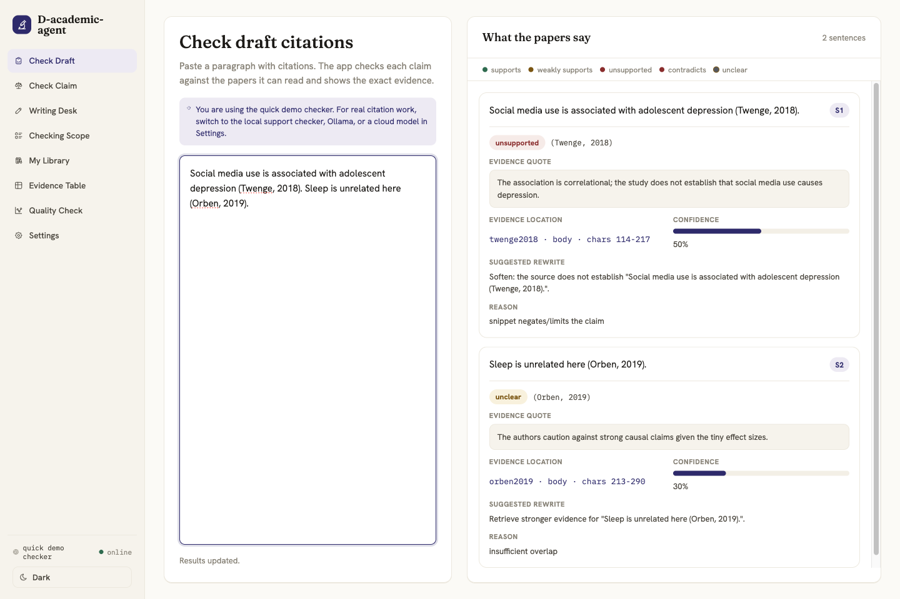
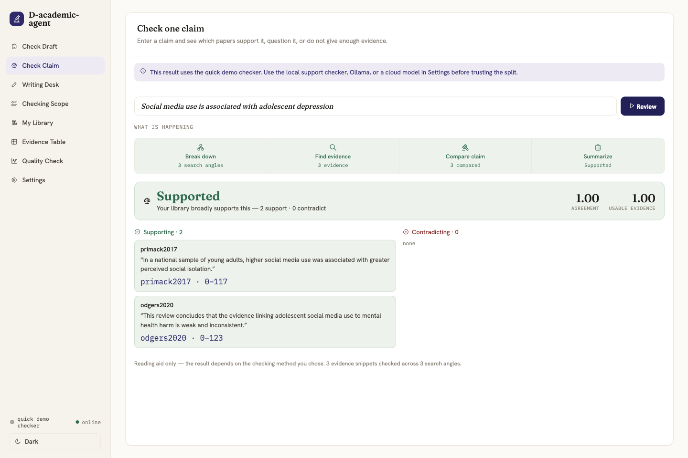
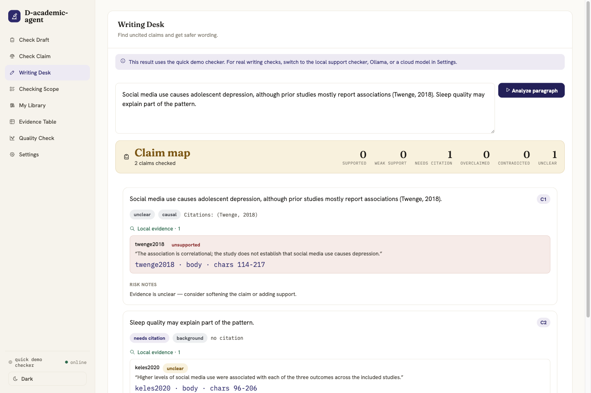
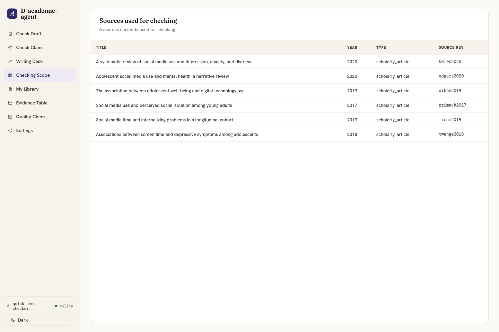
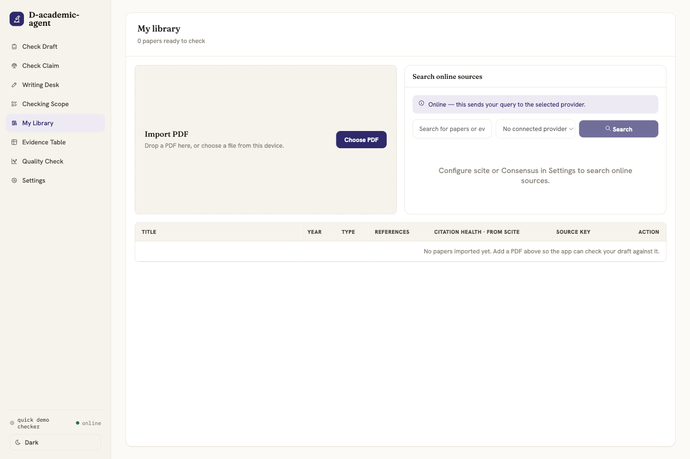
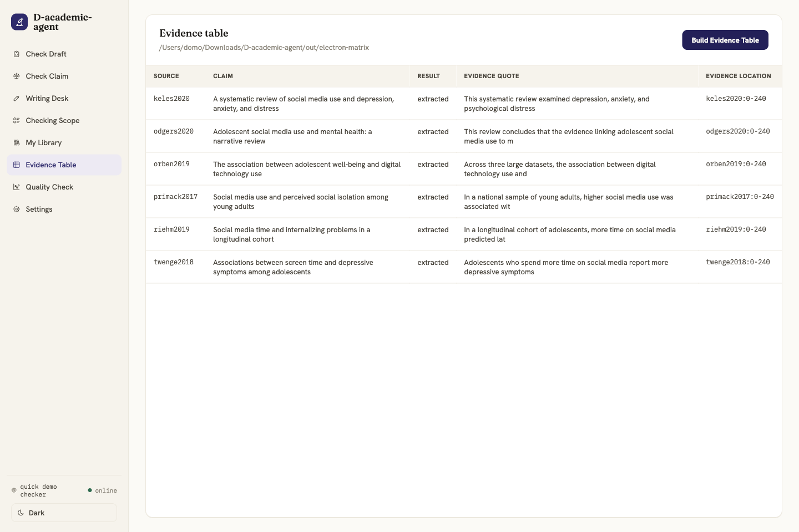
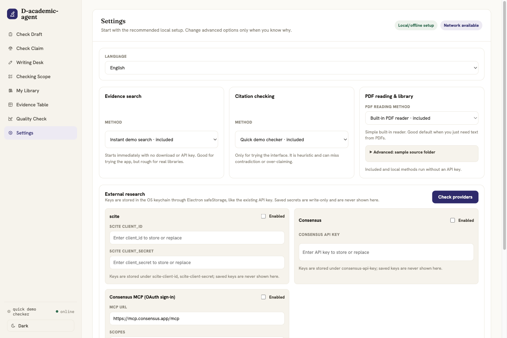

# D-academic-agent

English | [中文文档](README.zh-CN.md)

D-academic-agent is a desktop reading room for checking academic claims against the paper evidence you provide.
It helps researchers, students, reviewers, and editors ask a practical question:

**Does this sentence or citation match what the paper actually says?**

The app is local-first. You can try it with the built-in sample corpus without an API key. When you connect optional
online providers, some search text or evidence snippets may leave your computer.

## What You Can Do

- Check a draft paragraph with citations and see which claims are supported, weakly supported, unsupported,
  contradicted, or unclear.
- Check one standalone research claim against the active evidence collection.
- Import PDFs into a local paper library.
- Use the Writing Desk to find uncited claims, overclaims, unclear evidence, and safer wording.
- Build an evidence table from the active corpus.
- Run a small quality check to understand how the current setup behaves.
- Keep basic work offline, then opt into local models, Ollama, OpenAI-compatible APIs, scite, or Consensus when needed.

D-academic-agent is not a paper-writing tool. It is a reading and evidence-checking tool.

## Screenshots

### Check Draft

Paste draft prose with citations. The app checks each cited claim against readable evidence and shows the quote,
source location, confidence, reason, and suggested rewrite.



### Check Claim

Enter one research claim. The app searches the active corpus, compares snippets with the claim, and separates
supporting evidence from contradicting evidence.



### Writing Desk

Paste a paragraph before revising it. Writing Desk highlights claims that need citations, claims that are too strong,
claims where the local evidence is unclear, and safer wording where available.



### Checking Scope

See what the checker can search right now. This is the active evidence collection, not necessarily every paper in
your library.



### My Library

Import academic PDFs, manage local sources, and prepare the material the checker can use.



### Evidence Table

Create a literature-matrix style table with claims, evidence quotes, verdicts, and source locations.



### Quality Check

Run a small built-in check set to understand the current setup. This is a development sanity check, not a public
benchmark or leaderboard score.


### Settings

Choose offline, local, or remote checking methods; configure PDF reading; connect optional scholarly providers; and
switch language or theme.



## Quick Start

You need Node.js and npm. The app currently runs from source.

```sh
npm install
npm start
```

`npm start` builds the desktop app and opens Reading Room.

No API key is required for the built-in sample corpus and quick demo checker. The demo checker is useful for trying
the interface, but it is not the best choice for serious citation work. For real review, use Settings to choose a
stronger local checker, an Ollama-compatible local model, or an OpenAI-compatible checker.

## A Typical Workflow

1. Open Reading Room with `npm start`.
2. Use the built-in sample corpus, or import your own PDFs in **My Library**.
3. In **Settings**, choose how evidence search and citation checking should run.
4. Paste a paragraph in **Check Draft** or **Writing Desk**.
5. Read the evidence quote and source location before trusting any verdict.
6. Rewrite the claim or citation when the evidence is weak, contradicted, or unclear.

## How To Read Verdicts

The app compares a claim with retrieved paper snippets. It does not decide scientific truth.

- `supports`: the snippet directly supports the claim.
- `weakly supports`: the snippet points in the same direction, but the wording may need to be softer.
- `unsupported`: the snippet does not provide enough evidence for the claim.
- `contradicts`: the snippet pushes against the claim.
- `unclear`: the snippet is not enough to make a useful call.

Always inspect the quote and locator. A verdict is a reading aid, not a substitute for your judgment.

## Privacy And Data

Basic use can stay local:

- The built-in sample corpus runs without an API key.
- Imported PDFs and local library chunks stay on your computer unless you choose an online provider.
- Local/offline search and local checking methods do not send your draft to a remote API.

Online features are opt-in:

- OpenAI-compatible embedding or judge providers may receive search text or evidence snippets.
- scite and Consensus searches send the query text shown in the UI.
- Consensus MCP sign-in uses OAuth; tokens are stored locally through the desktop app's secret storage path.
- Saved API keys and tokens are write-only in the UI and are not shown back after saving.

## Choosing A Checking Method

| Need | Suggested choice | Notes |
| --- | --- | --- |
| Try the app quickly | Quick demo checker | No API key; not reliable enough for final review. |
| Keep work local | Local support checker or Ollama | Ollama runs local language models on your computer; local setup or download is required. |
| Use a remote model | OpenAI-compatible checker | Sends configured snippets or search text to that API. |
| Search scholarly services | scite or Consensus | Optional provider credentials required. |
| Read PDFs | Built-in PDF reader | GROBID can be used when you want section-aware parsing. |

## What This Is Not

D-academic-agent does not:

- write a paper for you;
- hide AI-generated writing;
- replace a literature review;
- prove that a claim is true in the real world;
- sync with Zotero;
- silently upload your PDFs, drafts, or local library to scholarly providers;
- turn the built-in quality check into an authoritative benchmark.

## Advanced: CLI

The desktop app is the main user experience. The CLI is useful for repeatable checks and automation.

```sh
npm run harness -- eval --mock --out out/eval-mock
npm run harness -- plan --mock --q "social media and adolescent depression"
npm run harness -- mcp
```

Provider-backed CLI runs use environment variables:

```sh
AGENT_BASE_URL=https://...
AGENT_MODEL=...
AGENT_API_KEY=...
```

Use `--mock` when you want deterministic offline behavior.

## Advanced: MCP Server

Start the stdio MCP server:

```sh
npm run harness -- mcp
```

The MCP surface lets other agent hosts search sources, open full text, check claims, extract citations, build a
matrix, and run the small eval. Read-only tools return trace information as tool-result data; write tools are guarded
to project-local output paths.

## Developer Commands

```sh
npm test
npm run typecheck
npm run lint
npm run build:app
npm run acceptance
npm run screenshots:readme
```

Use `npm run screenshots:readme` to refresh the English and Chinese README screenshots after UI changes.
Use `npm run package` when you need a local macOS `.app` directory build.
