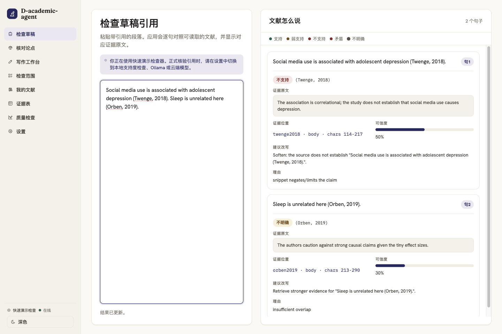
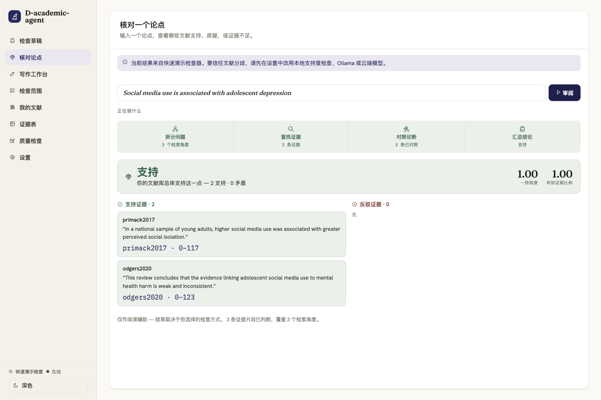
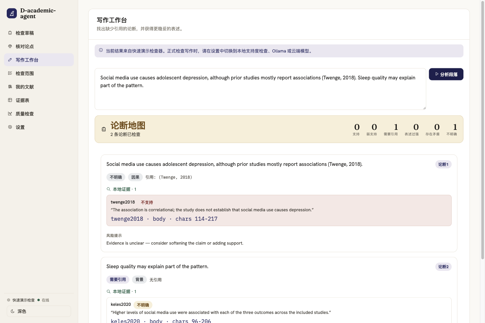
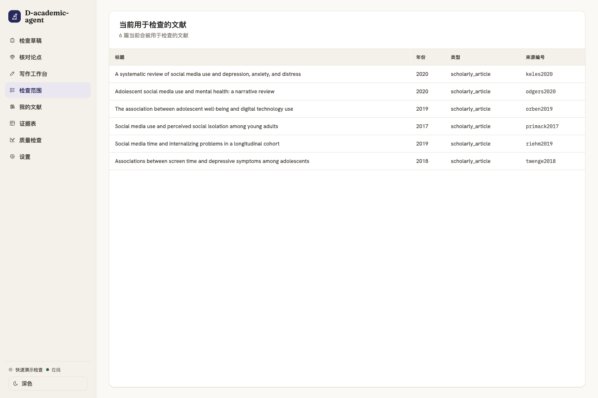
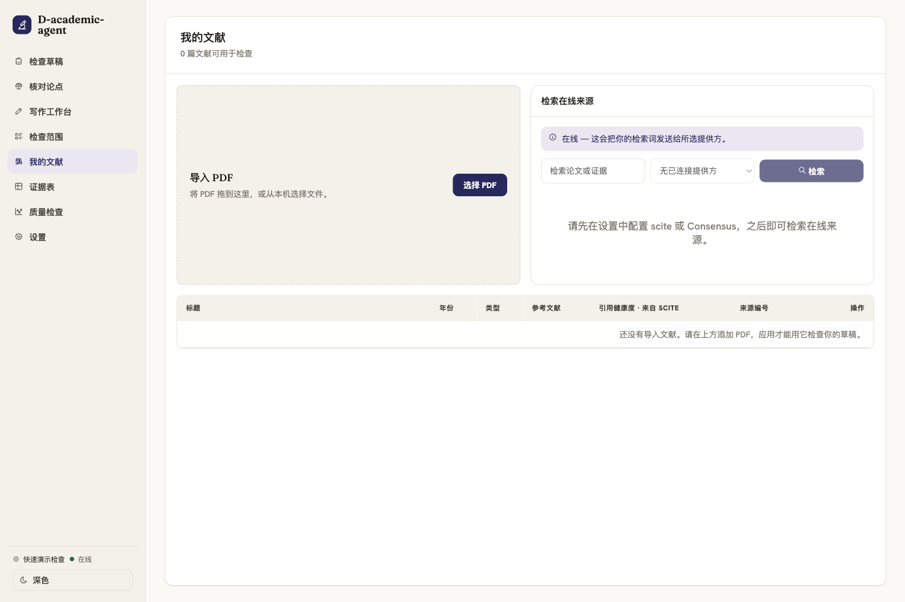
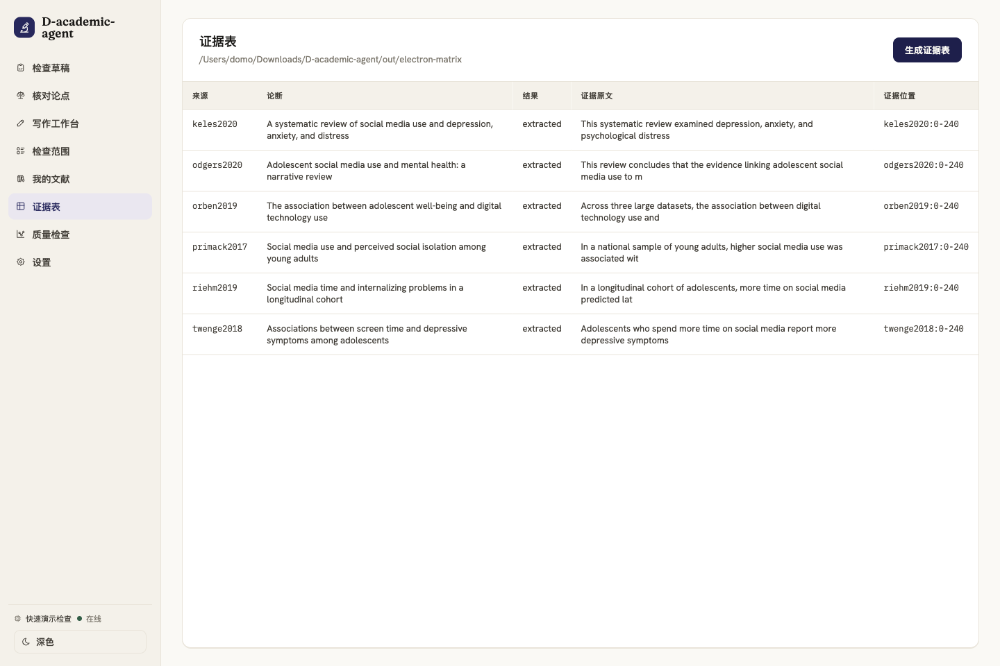
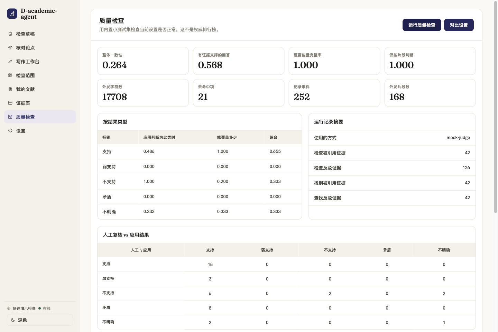
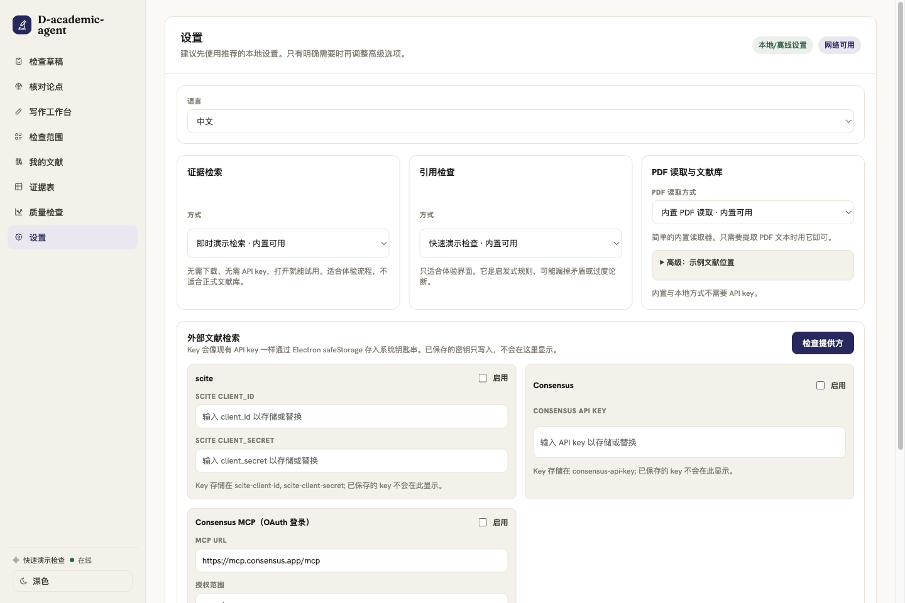

# D-academic-agent

[English README](README.md) | 中文文档

D-academic-agent 是一个本地优先的学术证据核验 Agent。它帮助研究者检查某个论断、草稿句子或引用，是否真的被应用检索到的论文片段支持。

这个项目目前有三个可用入口：

- **Reading Room**：Electron 桌面工作区，用于检查草稿、核对单个论点、辅助写作、管理文献库、生成证据表、运行质量检查和配置提供方。
- **无头 CLI**：用于评测、回放、规划、失败钻取、消融对比和启动 MCP。
- **MCP server**：为其他 Agent 宿主提供 stdio 工具接口。

最重要的规则很明确：检查器只能根据检索到的片段判断，不能用模型先验、语义猜测或表面相似度补全证据缺口。

## 当前状态

截至 2026-06-30：

- 默认路径可离线运行，使用 `fixtures/corpus/` 中的种子语料。
- Reading Room 有 8 个标签页：检查草稿、核对论点、写作工作台、检查范围、我的文献、证据表、质量检查、设置。
- 面向用户的项目名是 `D-academic-agent`，机器可读 ID 使用 `d-academic-agent`。
- scite、Consensus、远程模型等外部提供方默认不启用，需要用户自己配置凭证。
- 内置种子评测只用于仓库级 sanity check，不是公开排行榜或权威 benchmark。

## 界面截图

以下截图来自当前 Electron 应用，可用下面命令重新生成：

```sh
npm run screenshots:readme
```

### 检查草稿

粘贴带引用的段落。Reading Room 会提取被引用的论断，解析引用，检索可读取来源中的片段，并展示结果、证据原文、位置、可信度、理由和更稳妥表述。



### 核对论点

输入一个 thesis 或研究论点。应用会执行可见的 `plan -> retrieve -> judge -> report` 流程，并分开展示支持证据和反驳证据。



### 写作工作台

粘贴段落后，应用会拆分事实性论断、标注论断类型、提示缺少引用或表述过强的位置，并显示本地证据。外部检索只会发送用户确认过的检索词。



### 检查范围

查看当前检索语料。这是检查器现在能搜索的材料，和持久化的个人文献库不同。



### 我的文献

导入 PDF、管理本地来源、在配置提供方后检查参考文献健康状态，并在检索设置变化时重建索引。



### 证据表

基于当前语料生成项目本地的文献证据矩阵。输出路径受保护，CLI、MCP 和桌面端写入都限制在项目本地路径内。



### 质量检查

运行内置种子评测，查看 macro-F1、groundedness 信号、trace 数量、混淆矩阵和失败案例。这个页面用于开发 sanity check 和漂移诊断，不用于排行榜式结论。



### 设置

选择离线、本地下载或远程提供方；配置语料和文献库路径；保存密钥引用；启用 scite、Consensus REST 或 Consensus MCP；切换语言和主题。



## 快速开始

```sh
npm install
npm start
```

`npm start` 会构建 Electron bundle 并打开 Reading Room。使用默认种子语料和演示路径不需要 API key。

默认检查器是轻量演示检查器，适合跑通界面和流程。正式做引用核验时，应在设置中切换到更强的本地支持度检查、Ollama 兼容模型或 OpenAI 兼容模型。

## Reading Room 使用指南

### 检查草稿

当你已有带引用的草稿时，使用“检查草稿”。流程如下：

1. 将草稿拆分成句子。
2. 检测句内引用。
3. 将引用解析到可读取来源。
4. 通过 `makeClaimCitationPair()` 形成类型化的 `ClaimCitationPair`。
5. 从被引用来源检索证据片段。
6. 只根据检索到的片段判断论断。
7. 展示结果、证据原文、位置、可信度、理由、建议改写和语料中的反证。

可能的论断结果包括 `supports`、`weakly_supports`、`unsupported`、`contradicts` 和 `unclear`。

### 核对论点

“核对论点”适合检查单独的 thesis 或研究论点。Planner 会把论点拆成子查询，从当前语料或文献库检索证据，判断片段，并报告：

- 支持来源数量；
- 反驳来源数量；
- 混合证据数量；
- 一致程度和有效证据比例；
- 代表性的支持片段和反驳片段；
- 每张证据卡对应的来源位置。

### 写作工作台

“写作工作台”适合把笔记改成段落前，或修改段落时使用。它会识别事实性论断，标注论断类型，提示风险状态，并给出更稳妥表述。它能区分本地支持、弱支持、缺少引用、表述过强、存在矛盾和证据不明确。

写作工作台中的外部检索只会发送用户确认的查询文本，不会静默上传完整草稿或本地文献库。

### 检查范围

“检查范围”展示当前检索语料，回答的是：“检查器现在能搜索什么？”

### 我的文献

“我的文献”是用户导入论文的持久化集合。它支持 PDF 导入、DOI 捕获、来源和 chunk 持久化、提供方设置变化后的自动重建索引、配置后的外部检索，以及在可用 provider 下的参考文献健康检查。

默认 PDF 解析器是 `unpdf`。如果需要更清晰的章节和参考文献结构，可以使用本地或可访问的 GROBID 服务。

### 证据表

“证据表”生成类似 spreadsheet 的文献矩阵，包含论断、结果、证据原文和位置。Reading Room 会管理输出路径；CLI 和 MCP 写入时使用项目本地 guard。

### 质量检查

“质量检查”运行种子评测并展示：

- 按类别的 precision、recall 和 F1；
- macro-F1；
- 混淆矩阵；
- groundedness 和 snippet-only 策略信号；
- 外发片段数量；
- 可回放的 trace-event 摘要；
- 在本地模型可用时的消融对比行。

这些指标只用于报告和诊断，不是权威 benchmark，也不作为 M0/M1 的 pass/fail 阈值。

### 设置

“设置”管理非密钥配置和密钥引用。API key、client secret、OAuth token 等密钥不会直接存进普通配置文件，而是通过 key reference 在运行时解析。已经保存的密钥不会在 UI 中回显。

## 无头 CLI

CLI 与 Reading Room 使用同一套核心代码。

```sh
npm run harness -- eval --mock --out out/eval-mock
npm run harness -- replay --trace out/eval-mock/trace.jsonl
npm run harness -- plan --mock --q "social media and adolescent depression"
npm run harness -- drill --out out/drill
npm run harness -- coevo --mock --out out/coevo
npm run harness -- mcp
```

使用 provider-backed `eval` 时需要：

```sh
AGENT_BASE_URL=https://...
AGENT_MODEL=...
AGENT_API_KEY=...
```

`AGENT_EMBED_MODEL` 和 `AGENT_EMBED_DIM` 是可选项。需要确定性离线运行时使用 `--mock`。

## MCP Server

启动 stdio MCP server：

```sh
npm run harness -- mcp
```

已注册工具：

| 工具 | 模式 | 作用 |
| --- | --- | --- |
| `search_sources` | read-only | 混合检索证据 chunk。 |
| `get_fulltext` | read-only | 返回某个来源的全文。 |
| `check_claim` | read-only | 对 claim/source pair 运行可移植的引用核验 skill。 |
| `extract_citations` | read-only | 将文内引用解析到已知来源。 |
| `build_matrix` | writes-local | 在受保护的项目本地输出路径写入文献矩阵。 |
| `run_eval` | writes-local | 运行种子评测，并在受保护的项目本地输出路径写入报告和 trace。 |

read-only 工具会把 `TraceEvent` 作为工具结果返回，不会自己持久化 JSONL。持久化由 CLI、Electron worker、eval runner 或项目本地写入工具负责。

## 架构

```text
src/
  app/          Electron adapter 的 worker 协议和运行时
  check/        只看片段的 claim judge
  citation/     引用解析和 mention 处理
  coevo/        消融与失败案例打包
  corpus/       来源组装和 fixture 锁定
  draft/        句子、mention 和草稿核验流水线
  dx/           trace 回放和失败钻取
  eval/         gold 加载、指标、策略合规、runner
  external/     scite、Consensus、MCP client、provider 标准化
  ingest/       文本、BibTeX、PDF ingest
  library/      持久化本地文献库和 DOI/GROBID helper
  mcp/          MCP stdio server 和工具注册
  plan/         planner、orchestrator、synthesis
  providers/    provider 配置、registry、本地模型下载、key ref
  retrieve/     chunking、lexical search、dense search、RRF
  tools/        MCP/core 工具实现和项目本地写入 guard
  trace/        版本化 trace event
  writing/      写作工作台 claim analysis 和报告 helper

electron/
  main process、preload bridge、OAuth/keychain helper、renderer、i18n、styles
```

无头核心不 import Electron。Electron 负责 BrowserWindow、IPC、keychain/safeStorage 边界、OAuth 浏览器流程、本地配置 UI 和桌面生命周期。Worker 接收已经解析好的运行时配置；密钥留在 key reference 后面。

## 提供方

| 类别 | Provider | 默认 | 是否需要凭证 | 说明 |
| --- | --- | --- | --- | --- |
| Embedding | `hash` | 是 | 否 | 确定性的离线 baseline。 |
| Embedding | `transformers-local` | 否 | 否 | 本地 ONNX 模型下载路径。 |
| Embedding | `openai-compatible` | 否 | 是 | 使用配置的 base URL、model、dimensions 和 key ref。 |
| Judge | `mock` | 是 | 否 | 用于 UI 和确定性测试的快速演示检查器。 |
| Judge | `transformers-nli` | 否 | 否 | 下载后可用的本地 NLI 模型路径。 |
| Judge | `openai-compatible` | 否 | 是 | 通过 OpenAI 兼容 endpoint 做远程 LLM 判断。 |
| PDF | `unpdf` | 是 | 否 | 内置 PDF 文本解析。 |
| PDF | `grobid` | 否 | 不需要 API key | 使用本地或可访问的 GROBID 服务。 |
| 外部文献 | scite REST/MCP | 否 | 是 | 配置后提供检索和参考文献健康信号。 |
| 外部文献 | Consensus REST | 否 | 是 | 通过用户提供的 API key 检索。 |
| 外部文献 | Consensus MCP | 否 | OAuth token | OAuth 2.1 PKCE 和 Dynamic Client Registration 流程。 |

普通草稿检查和本地文献库工作不需要 scite 或 Consensus。外部文献结果是候选证据，不是应用的最终裁定。

## 评测与 Trace 纪律

种子语料在 `fixtures/corpus/`。人工编写的 gold claims 在 `fixtures/gold_claims.jsonl`，并与 `fixtures/sources.lock.json` 锁定。

如果语料文本变化，需要同时重新生成 lock 和 gold：

```sh
npm run freeze
npx tsx scripts/build_gold.ts
npm run lint
```

评测系统会记录版本化 trace event，包括检索排名、来源 hash、prompt/model metadata 和外发片段审计数据。这些信息用于调试和回归诊断。不要把 M0/M1 种子指标当成权威 benchmark。

## 隐私与数据边界

- 本地草稿检查和文献库检索可以不调用在线 API。
- 导入的 PDF 和本地文献库 chunk 默认留在本机，除非用户启用在线 provider。
- 外部文献检索只发送相关 UI 控件中显示的查询文本。
- 远程 judge 和 embedding provider 会按所选配置接收片段或搜索文本。
- 已保存的 API key、OAuth token、client secret 在 UI 中只写入不回显，并通过 secret ref 解析。

## 开发命令

```sh
npm test
npm run typecheck
npm run lint
npm run acceptance
npm run build:app
npm run screenshots:readme
```

生成 macOS app 目录包：

```sh
npm run package
```

scite、Consensus REST、Consensus MCP、OAuth 浏览器流程和远程模型检查都依赖环境凭证。只有在本次运行确实提供了相关凭证时，才能声称这些链路已验证。

## 文档地图

- [English README](README.md)：英文项目指南，使用英文 UI 截图。
- [当前状态](docs/CURRENT_STATE.md)：简明实现快照和验证门禁。
- [Agent 指令](AGENTS.md)：仓库 guardrails 和 constitution router。
- [Claim Check Constitution](constitutions/CLAIM_CHECK_CONSTITUTION.md)：snippet-only 引用核验规则。
- [原始 Lit Review Harness Spec](docs/2026-06-22-litreview-harness-spec.md)：历史设计规格。
- [计划索引](docs/plans/README.md)：里程碑计划和 review notes。
- [Electron Smoke Checklist](electron/SMOKE.md)：手工桌面端 smoke checklist。
- [标注 Rubric](fixtures/ANNOTATION_RUBRIC.md)：人工 gold label 规则。
- [原始产品愿景](assignment-aware-literature-review-agent.md)：早期产品叙事。

历史计划是当时的记录。当前行为以本 README 和 `docs/CURRENT_STATE.md` 为准。

## Guardrails 与非目标

硬性 guardrails：

- `check_claim` 只能看到检索片段。
- 工具函数返回 trace data；runner 负责持久化。
- Gold label 由人工编写，系统不能自我标注 gold。
- M0/M1 指标只用于报告。
- `ClaimCitationPair` 只能通过 `makeClaimCitationPair()` 创建。
- 外部检索结果是候选证据，不是应用最终裁定。
- 不变量是可执行门禁。运行 `npm run lint`。

非目标：

- 一键生成论文；
- 规避 AI 检测；
- LMS 或教师监控工作流；
- Zotero 同步；
- 从种子评测得出权威 benchmark 结论；
- 静默把草稿、PDF 或本地文献库内容发送给外部文献 provider。
